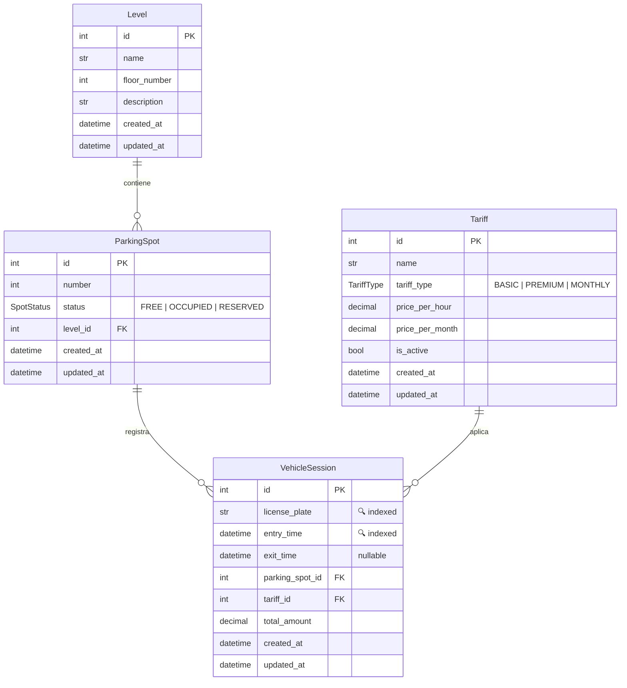

# 02 — Modelos ORM (Django)

## Diagrama de Relaciones (ERD)

## Enums

### `SpotStatus` (TextChoices)

| Valor | Label | Color |
|-------|-------|-------|
| `free` | 🟢 Libre | Verde |
| `occupied` | 🔴 Ocupado | Rojo |
| `reserved` | 🔵 Reservado | Azul |

### `TariffType` (TextChoices)

| Valor | Label |
|-------|-------|
| `basic` | Básico |
| `premium` | Premium |
| `monthly` | Mensual |

## Índices de Rendimiento

Los siguientes campos están indexados para optimizar las consultas frecuentes del dashboard:

| Campo | Modelo | Justificación |
|-------|--------|---------------|
| `status` | `ParkingSpot` | Filtrado rápido de plazas libres/ocupadas |
| `license_plate` | `VehicleSession` | Búsqueda de vehículos por matrícula |
| `entry_time` | `VehicleSession` | Consultas de ingresos diarios y filtros por fecha |
| `(license_plate, entry_time)` | `VehicleSession` | Índice compuesto para historial por matrícula |
| `exit_time` (parcial) | `VehicleSession` | Índice parcial: solo donde `exit_time IS NULL` (vehículos activos) |

## Constraints

| Constraint | Tipo | Modelo | Descripción |
|-----------|------|--------|-------------|
| `unique_spot_per_level` | UNIQUE | `ParkingSpot` | No puede haber dos plazas con el mismo número en el mismo nivel |
| `parking_spot` FK | PROTECT | `VehicleSession` | No se puede eliminar una plaza que tiene sesiones |
| `tariff` FK | PROTECT | `VehicleSession` | No se puede eliminar una tarifa que tiene sesiones |

## Código

El código completo de los modelos está en [`parking/models.py`](file:///home/samir/Repositorios/Gestio_parking/parking/models.py).

### Mapeo con el sistema anterior

| Modelo antiguo (Peewee) | Modelo nuevo (Django) | Notas |
|--------------------------|----------------------|-------|
| `plazas` | `ParkingSpot` + `Level` | Se añade la agrupación por niveles |
| `estacionamientos` | `VehicleSession` | Campo `_import_total` → `total_amount` |
| `preus` | `Tariff` | Precio por mes → tipos de tarifa más flexibles |
| *(no existía)* | `Level` | Nuevo modelo para organizar por plantas |
