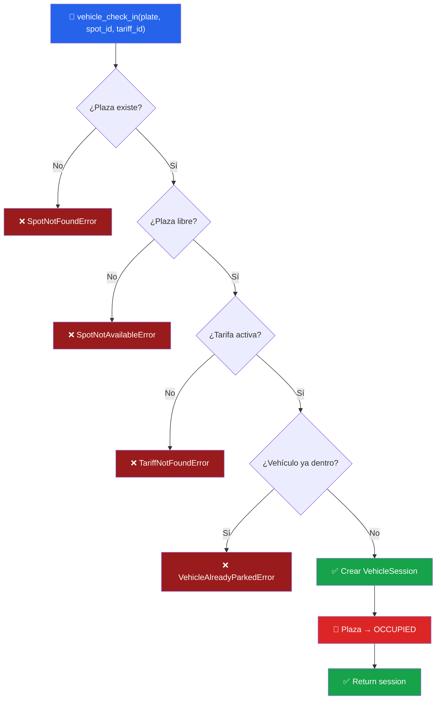
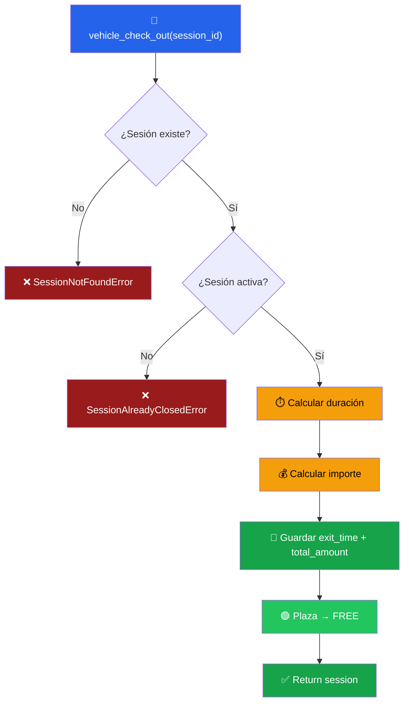

# 04 — Servicios y Lógica de Negocio (Escritura)

## Principio: Todo Cambio Pasa por un Servicio

Ningún modelo, vista ni serializador debe mutar la base de datos directamente. Todas las operaciones de escritura se canalizan por `services.py`, donde se aplican:

1. **Validaciones de negocio** (plaza libre, vehículo no duplicado, tarifa activa).
2. **Transacciones atómicas** (`@transaction.atomic`) para garantizar consistencia.
3. **Bloqueos pesimistas** (`select_for_update()`) para evitar race conditions.

## Servicios Implementados

### Operaciones Principales

| Servicio | Firma | Descripción |
|----------|-------|-------------|
| `vehicle_check_in` | `(*, license_plate: str, spot_id: int, tariff_id: int) -> VehicleSession` | Registra entrada de vehículo |
| `vehicle_check_out` | `(*, session_id: int) -> VehicleSession` | Registra salida y factura |

### Operaciones Auxiliares

| Servicio | Firma | Descripción |
|----------|-------|-------------|
| `reserve_spot` | `(*, spot_id: int) -> ParkingSpot` | Reserva una plaza (🔵) |
| `cancel_reservation` | `(*, spot_id: int) -> ParkingSpot` | Cancela una reserva |

> **Nota:** Todos los servicios usan keyword-only arguments (`*`) para mayor claridad y seguridad.

## Excepciones Personalizadas

```
ParkingServiceError (base)
├── SpotNotAvailableError      # La plaza no está libre
├── SpotNotFoundError          # La plaza no existe
├── TariffNotFoundError        # La tarifa no existe o está inactiva
├── SessionNotFoundError       # La sesión no existe
├── SessionAlreadyClosedError  # La sesión ya fue cerrada
└── VehicleAlreadyParkedError  # El vehículo ya está dentro
```

## Flujo de `vehicle_check_in`



## Flujo de `vehicle_check_out`



## Lógica de Facturación (`_calculate_amount`)

### Tarifas por hora (BASIC / PREMIUM)

```
Tiempo real → Horas facturadas (redondeo arriba)
─────────────────────────────────────────────────
0h 01min     → 1 hora   (mínimo 1h)
1h 00min     → 1 hora
1h 01min     → 2 horas
2h 15min     → 3 horas
23h 59min    → 24 horas

Importe = horas_facturadas × price_per_hour
```

### Tarifa mensual (MONTHLY)

```
Importe = price_per_month (fijo, independiente del tiempo)
```

## Concurrencia: `select_for_update()`

Los servicios usan bloqueos pesimistas para evitar condiciones de carrera:

```python
# Dos usuarios intentan la misma plaza al mismo tiempo:
# → El primero la bloquea con SELECT FOR UPDATE
# → El segundo espera hasta que la transacción del primero termine
# → Si la plaza ya está ocupada, recibe SpotNotAvailableError

spot = ParkingSpot.objects.select_for_update().get(id=spot_id)
```

Esto es crítico en un parking real donde múltiples cajeros/terminales pueden operar simultáneamente.

## Código

El código completo está en [`parking/services.py`](file:///home/samir/Repositorios/Gestio_parking/parking/services.py).

### Mapeo con el sistema anterior

| Funcionalidad antigua | Servicio nuevo |
|----------------------|----------------|
| INSERT con SQL crudo + `plazas.update(estado='SI')` | `vehicle_check_in()` |
| `estacionamientos.update()` + cálculo manual de minutos × precio | `vehicle_check_out()` + `_calculate_amount()` |
| *(no existía)* | `reserve_spot()` |
| *(no existía)* | `cancel_reservation()` |
